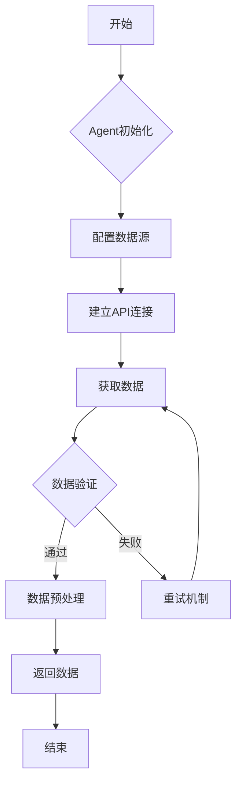
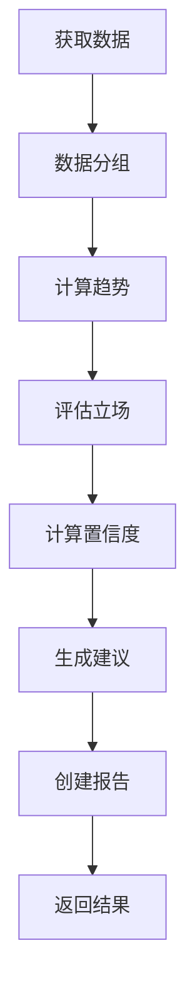

# 期货交易AI Agent - 技术文档

**版本**: v1.0.0  
**更新日期**: 2025-07-03

---

## 📋 目录

1. [系统架构](#系统架构)
2. [核心模块](#核心模块)
3. [Agent实现](#agent实现)
4. [数据流设计](#数据流设计)
5. [工作流引擎](#工作流引擎)
6. [扩展开发](#扩展开发)

---

## 🏗️ 系统架构

### 整体架构

```
┌─────────────────────────────────────────────────────────────┐
│                    LangGraph工作流层                          │
├─────────────────────────────────────────────────────────────┤
│     MacroPolicy    │   GlobalSentiment   │  OptionStructure  │
│        Agent       │        Agent        │       Agent       │
├─────────────────────────────────────────────────────────────┤
│  BaseAgent抽象层   │   共用服务层        │   数据模型层        │
├─────────────────────────────────────────────────────────────┤
│    FRED API        │   Alpha Vantage     │   Yahoo Finance   │
│                    │    + News APIs      │   + Option Data   │
├─────────────────────────────────────────────────────────────┤
│            配置管理层    │    日志系统    │    工具函数层      │
└─────────────────────────────────────────────────────────────┘
```

### 设计原则

1. **模块化设计**: 各Agent独立开发，松耦合
2. **异步处理**: 所有IO操作异步化，提高性能
3. **错误容忍**: 单个Agent失败不影响整体系统
4. **可扩展性**: 支持新Agent和数据源的快速集成

---

## 🧩 核心模块

### BaseAgent抽象类

```python
"""agents/base_agent.py"""

from abc import ABC, abstractmethod
from typing import Dict, Any, List, Optional

class BaseAgent(ABC):
    """Agent基础抽象类"""
    
    def __init__(self, name: str, config: Dict[str, Any]):
        self.name = name
        self.config = config
        self.logger = logger.bind(agent=name)
        
    @abstractmethod
    async def initialize(self) -> None:
        """初始化Agent - 子类必须实现"""
        
    @abstractmethod
    async def fetch_data(self) -> Dict[str, Any]:
        """获取数据 - 子类必须实现"""
        
    @abstractmethod
    async def analyze(self, data: Dict[str, Any]) -> Dict[str, Any]:
        """分析数据 - 子类必须实现"""
        
    @abstractmethod
    async def generate_report(self, analysis: Dict[str, Any]) -> str:
        """生成报告 - 子类必须实现"""
        
    async def run(self) -> Dict[str, Any]:
        """运行Agent完整流程"""
        # 统一的执行流程
        await self.initialize()
        data = await self.fetch_data()
        analysis = await self.analyze(data)
        report = await self.generate_report(analysis)
        return {
            "agent": self.name,
            "data": data,
            "analysis": analysis,
            "report": report
        }
```

### 数据源基类

```python
"""data_sources/base_source.py"""

from abc import ABC, abstractmethod
from typing import Dict, Any, List, Optional
from datetime import datetime

class BaseDataSource(ABC):
    """数据源基础抽象类"""
    
    def __init__(self, config: Dict[str, Any]):
        self.config = config
        self.timeout = config.get('timeout', 30)
        
    @abstractmethod
    async def initialize(self) -> None:
        """初始化数据源"""
        
    @abstractmethod
    async def fetch_data(self, symbols: List[str], **kwargs) -> Dict[str, Any]:
        """获取数据"""
        
    @abstractmethod
    def get_supported_symbols(self) -> List[str]:
        """获取支持的交易品种"""
        
    @abstractmethod
    async def cleanup(self) -> None:
        """清理资源"""
```

---

## 🤖 Agent实现

### MacroPolicyAgent详细实现

```python
"""agents/macro_policy_agent.py"""

class MacroPolicyAgent(BaseAgent):
    """宏观政策分析Agent"""
    
    def __init__(self, config: Dict[str, Any]):
        super().__init__("MacroPolicyAgent", config)
        
        # 核心指标权重配置
        self.indicator_weights = {
            'FEDFUNDS': 0.25,     # 联邦基金利率
            'UNRATE': 0.20,       # 失业率
            'CPIAUCSL': 0.20,     # CPI
            'GDP': 0.15,          # GDP
            'DGS10': 0.10,        # 10年期国债收益率
            'PAYEMS': 0.10        # 非农就业
        }
        
        # 政策立场判断阈值
        self.policy_thresholds = {
            'hawkish': 0.6,       # 鹰派阈值
            'dovish': -0.6,       # 鸽派阈值
            'neutral': 0.2        # 中性区间
        }
        
    async def initialize(self) -> None:
        """初始化Agent"""
        self.fred_source = FredDataSource({
            'api_key': self.config.get('fred_api_key'),
            'timeout': 30
        })
        await self.fred_source.initialize()
        
    async def fetch_data(self) -> Dict[str, Any]:
        """获取宏观经济数据"""
        # 获取关键经济指标
        indicators = list(self.indicator_weights.keys())
        data = await self.fred_source.fetch_data(
            symbols=indicators,
            start_date=datetime.now() - timedelta(days=730),
            end_date=datetime.now()
        )
        
        # 获取更多政策相关指标
        additional_indicators = [
            'PCEPILFE',    # 核心PCE
            'INDPRO',      # 工业生产
            'HOUST',       # 新屋开工
            'UMCSENT',     # 密歇根消费者信心
            'WALCL',       # 美联储资产负债表
            'RRPONTSYD'    # 隔夜逆回购
        ]
        
        additional_data = await self.fred_source.fetch_data(
            symbols=additional_indicators,
            start_date=datetime.now() - timedelta(days=365),
            end_date=datetime.now()
        )
        
        return {
            'source': 'FRED',
            'timestamp': datetime.now(),
            'indicators': data['data'] + additional_data['data'],
            'total_records': len(data['data'] + additional_data['data'])
        }
        
    async def analyze(self, data: Dict[str, Any]) -> PolicyAnalysis:
        """分析宏观政策环境"""
        indicators = data.get('indicators', [])
        
        # 按指标类型分组
        indicator_groups = self._group_indicators(indicators)
        
        # 计算各指标的趋势和变化
        trends = await self._calculate_trends(indicator_groups)
        
        # 评估政策立场
        policy_stance = self._evaluate_policy_stance(trends)
        
        # 计算置信度
        confidence = self._calculate_confidence(trends)
        
        # 生成其他分析结果
        key_indicators = self._identify_key_indicators(trends)
        risk_factors = self._assess_risk_factors(trends)
        recommendations = self._generate_recommendations(policy_stance, trends)
        next_meeting_prob = self._predict_next_meeting(trends)
        sentiment_score = self._calculate_sentiment_score(trends)
        
        return PolicyAnalysis(
            policy_stance=policy_stance,
            confidence=confidence,
            key_indicators=key_indicators,
            risk_factors=risk_factors,
            recommendations=recommendations,
            next_meeting_probability=next_meeting_prob,
            sentiment_score=sentiment_score
        )
        
    def _evaluate_policy_stance(self, trends: Dict[str, Any]) -> PolicyStance:
        """评估政策立场"""
        stance_score = 0.0
        
        # 根据各指标评估政策偏向
        for symbol, weight in self.indicator_weights.items():
            if symbol in trends:
                trend = trends[symbol]
                indicator_score = self._get_indicator_policy_score(symbol, trend)
                stance_score += indicator_score * weight
                
        # 根据分数确定政策立场
        if stance_score > self.policy_thresholds['hawkish']:
            return PolicyStance.HAWKISH
        elif stance_score < self.policy_thresholds['dovish']:
            return PolicyStance.DOVISH
        elif abs(stance_score) < self.policy_thresholds['neutral']:
            return PolicyStance.NEUTRAL
        else:
            return PolicyStance.MIXED
```

### GlobalSentimentAgent关键实现

```python
"""agents/global_sentiment_agent.py"""

class GlobalSentimentAgent(BaseAgent):
    """全球情绪分析Agent"""
    
    def __init__(self, config: Dict[str, Any]):
        super().__init__("GlobalSentimentAgent", config)
        
        # 全球主要指数
        self.global_indices = {
            '^GSPC': 'S&P 500',
            '^DJI': 'Dow Jones',
            '^IXIC': 'NASDAQ',
            '^FTSE': 'FTSE 100',
            '^GDAXI': 'DAX',
            '^N225': 'Nikkei 225'
        }
        
        # 波动率指标
        self.volatility_indicators = {
            '^VIX': 'VIX',
            '^VVIX': 'VVIX',
            '^VSTOXX': 'VSTOXX'
        }
        
    async def analyze(self, data: Dict[str, Any]) -> SentimentAnalysis:
        """分析市场情绪"""
        
        # 分析全球指数表现
        global_sentiment = self._analyze_global_indices(data['global_indices'])
        
        # 分析波动率指标
        volatility_analysis = self._analyze_volatility(data['volatility_data'])
        
        # 分析新闻情绪
        news_sentiment = self._analyze_news_sentiment(data['news_sentiment'])
        
        # 计算跨资产相关性
        correlation_analysis = self._analyze_correlations(data['cross_asset_correlation'])
        
        # 综合情绪评分
        overall_sentiment, sentiment_score = self._calculate_overall_sentiment(
            global_sentiment, volatility_analysis, news_sentiment, correlation_analysis
        )
        
        # 计算恐惧贪婪指数
        fear_greed_index = self._calculate_fear_greed_index(
            volatility_analysis, news_sentiment, correlation_analysis
        )
        
        # 评估风险级别
        risk_level = self._assess_risk_level(sentiment_score, fear_greed_index)
        
        return SentimentAnalysis(
            overall_sentiment=overall_sentiment,
            sentiment_score=sentiment_score,
            confidence=0.85,  # 示例值
            fear_greed_index=fear_greed_index,
            risk_level=risk_level,
            key_drivers=self._identify_key_drivers(data),
            market_regime=self._determine_market_regime(sentiment_score),
            volatility_assessment=volatility_analysis
        )
```

### OptionStructureAgent核心实现

```python
"""agents/option_structure_agent.py"""

class OptionStructureAgent(BaseAgent):
    """期权结构分析Agent"""
    
    def __init__(self, config: Dict[str, Any]):
        super().__init__("OptionStructureAgent", config)
        
    async def analyze(self, data: Dict[str, Any]) -> OptionAnalysisResult:
        """分析期权结构"""
        
        options_chain = data['options_chain']
        current_price = data['current_price']
        
        # 计算最大痛点
        max_pain = self._calculate_max_pain(options_chain)
        
        # 计算Gamma敞口
        gamma_exposure = self._calculate_gamma_exposure(options_chain, current_price)
        
        # 计算零Gamma水平
        zero_gamma_level = self._calculate_zero_gamma_level(options_chain, current_price)
        
        # 识别Call/Put墙
        call_wall, put_wall = self._identify_walls(options_chain)
        
        # 计算隐含波动率排名
        iv_rank = self._calculate_iv_rank(options_chain)
        
        # 识别支撑阻力位
        support_levels, resistance_levels = self._identify_support_resistance(
            options_chain, current_price
        )
        
        # 计算预期波动
        expected_move = self._calculate_expected_move(options_chain)
        
        # 计算质量评分
        quality_score = self._calculate_quality_score(data)
        
        return OptionAnalysisResult(
            max_pain_level=max_pain,
            gamma_exposure=gamma_exposure,
            zero_gamma_level=zero_gamma_level,
            call_wall=call_wall,
            put_wall=put_wall,
            implied_volatility_rank=iv_rank,
            support_levels=support_levels,
            resistance_levels=resistance_levels,
            expected_move=expected_move,
            quality_score=quality_score
        )
        
    def _calculate_max_pain(self, options_chain: List[OptionContract]) -> float:
        """计算最大痛点"""
        strikes = {}
        
        for option in options_chain:
            strike = option.strike
            if strike not in strikes:
                strikes[strike] = {'call_oi': 0, 'put_oi': 0}
            
            if option.option_type == OptionType.CALL:
                strikes[strike]['call_oi'] += option.open_interest
            else:
                strikes[strike]['put_oi'] += option.open_interest
        
        # 计算每个行权价的痛点值
        pain_values = {}
        for strike in strikes:
            pain_value = 0
            for s in strikes:
                if s > strike:
                    pain_value += strikes[s]['call_oi'] * (s - strike)
                elif s < strike:
                    pain_value += strikes[s]['put_oi'] * (strike - s)
            pain_values[strike] = pain_value
        
        # 返回痛点值最小的行权价
        return min(pain_values.items(), key=lambda x: x[1])[0]
```

---

## 🌊 数据流设计

### 数据获取流程



### 分析处理流程



---

## ⚙️ 工作流引擎

### LangGraph工作流设计

```python
"""workflows/comprehensive_analysis_workflow.py"""

from langgraph.graph import StateGraph, END
from typing import TypedDict

class AnalysisState(TypedDict):
    """分析状态定义"""
    target_symbol: str
    analysis_timestamp: datetime
    config: Dict[str, Any]
    
    # Agent分析结果
    macro_analysis: Optional[PolicyAnalysis]
    sentiment_analysis: Optional[SentimentAnalysis]
    option_analysis: Optional[OptionAnalysisResult]
    
    # 最终结果
    comprehensive_analysis: Optional[ComprehensiveAnalysis]
    final_report: Optional[str]

class ComprehensiveAnalysisWorkflow:
    """综合分析工作流"""
    
    def __init__(self, config: Dict[str, Any]):
        self.config = config
        self.agent_weights = {
            'macro': 0.4,      # 宏观分析权重
            'sentiment': 0.35, # 情绪分析权重
            'option': 0.25     # 期权分析权重
        }
        
    def _build_workflow(self) -> None:
        """构建LangGraph工作流"""
        
        # 创建状态图
        workflow = StateGraph(AnalysisState)
        
        # 添加节点
        workflow.add_node("start_analysis", self._start_analysis)
        workflow.add_node("run_macro_analysis", self._run_macro_analysis)
        workflow.add_node("run_sentiment_analysis", self._run_sentiment_analysis)
        workflow.add_node("run_option_analysis", self._run_option_analysis)
        workflow.add_node("synthesize_results", self._synthesize_results)
        workflow.add_node("generate_report", self._generate_report)
        
        # 设置入口点
        workflow.set_entry_point("start_analysis")
        
        # 添加边
        workflow.add_edge("start_analysis", "run_macro_analysis")
        workflow.add_edge("run_macro_analysis", "run_sentiment_analysis")
        workflow.add_edge("run_sentiment_analysis", "run_option_analysis")
        workflow.add_edge("run_option_analysis", "synthesize_results")
        workflow.add_edge("synthesize_results", "generate_report")
        workflow.add_edge("generate_report", END)
        
        # 编译工作流
        self.workflow = workflow.compile()
        
    async def _synthesize_results(self, state: AnalysisState) -> AnalysisState:
        """综合分析结果"""
        
        # 计算Agent共识度
        consensus = self._calculate_agent_consensus(
            state['macro_analysis'],
            state['sentiment_analysis'], 
            state['option_analysis']
        )
        
        # 生成市场展望
        market_outlook = self._generate_market_outlook(
            state['macro_analysis'],
            state['sentiment_analysis'],
            state['option_analysis'],
            consensus
        )
        
        # 生成交易信号
        trading_signals = self._generate_trading_signals(
            state['macro_analysis'],
            state['sentiment_analysis'],
            state['option_analysis'],
            market_outlook
        )
        
        # 创建综合分析结果
        state['comprehensive_analysis'] = ComprehensiveAnalysis(
            analysis_timestamp=state['analysis_timestamp'],
            target_symbol=state['target_symbol'],
            macro_analysis=state['macro_analysis'],
            sentiment_analysis=state['sentiment_analysis'],
            option_analysis=state['option_analysis'],
            consensus=consensus,
            market_outlook=market_outlook,
            trading_signals=trading_signals,
            # ... 其他字段
        )
        
        return state
```

---

## 🔧 扩展开发

### 自定义Agent开发

```python
"""示例：新闻情绪Agent"""

from agents.base_agent import BaseAgent
from data_sources.news_source import NewsDataSource

class NewsAgent(BaseAgent):
    """新闻情绪Agent"""
    
    def __init__(self, config: Dict[str, Any]):
        super().__init__("NewsAgent", config)
        
    async def initialize(self) -> None:
        """初始化Agent"""
        self.news_source = NewsDataSource(self.config)
        await self.news_source.initialize()
        
    async def fetch_data(self) -> Dict[str, Any]:
        """获取新闻数据"""
        return await self.news_source.fetch_data(['SPY', 'QQQ'])
        
    async def analyze(self, data: Dict[str, Any]) -> Dict[str, Any]:
        """分析新闻情绪"""
        # 实现新闻情绪分析逻辑
        pass
        
    async def generate_report(self, analysis: Dict[str, Any]) -> str:
        """生成新闻分析报告"""
        # 实现报告生成逻辑
        pass
```

### 自定义数据源开发

```python
"""示例：Twitter数据源"""

from data_sources.base_source import BaseDataSource

class TwitterDataSource(BaseDataSource):
    """Twitter数据源"""
    
    def __init__(self, config: Dict[str, Any]):
        super().__init__(config)
        self.api_key = config.get('twitter_api_key')
        
    async def initialize(self) -> None:
        """初始化Twitter API"""
        # 实现Twitter API初始化
        pass
        
    async def fetch_data(self, symbols: List[str], **kwargs) -> Dict[str, Any]:
        """获取Twitter数据"""
        # 实现Twitter数据获取
        pass
        
    def get_supported_symbols(self) -> List[str]:
        """获取支持的交易品种"""
        return ['SPY', 'QQQ', 'BTC', 'ETH']
```

### 工作流扩展

```python
"""扩展工作流节点"""

async def _run_news_analysis(self, state: AnalysisState) -> AnalysisState:
    """运行新闻分析"""
    try:
        news_data = await self.news_agent.fetch_data()
        state['news_analysis'] = await self.news_agent.analyze(news_data)
        state['completed_agents'].append('news')
    except Exception as e:
        state['agent_errors'].append(f"新闻分析: {str(e)}")
        state['failed_agents'].append('news')
    
    return state
```

---

## 🎯 性能优化

### 异步处理优化

```python
"""并行Agent执行"""

async def run_agents_parallel(self, state: AnalysisState) -> AnalysisState:
    """并行运行所有Agent"""
    
    tasks = []
    
    # 创建并行任务
    if self.macro_agent:
        tasks.append(self._run_macro_analysis(state))
    if self.sentiment_agent:
        tasks.append(self._run_sentiment_analysis(state))
    if self.option_agent:
        tasks.append(self._run_option_analysis(state))
    
    # 等待所有任务完成
    results = await asyncio.gather(*tasks, return_exceptions=True)
    
    # 处理结果
    for result in results:
        if isinstance(result, Exception):
            state['agent_errors'].append(str(result))
        else:
            state.update(result)
    
    return state
```

### 缓存机制

```python
"""数据缓存"""

import redis
from typing import Optional

class CacheManager:
    """缓存管理器"""
    
    def __init__(self, redis_url: str = "redis://localhost:6379"):
        self.redis = redis.from_url(redis_url)
        
    async def get_cached_data(self, key: str) -> Optional[Dict[str, Any]]:
        """获取缓存数据"""
        cached = await self.redis.get(key)
        if cached:
            return json.loads(cached)
        return None
        
    async def set_cached_data(self, key: str, data: Dict[str, Any], ttl: int = 300):
        """设置缓存数据"""
        await self.redis.setex(key, ttl, json.dumps(data))
```

---

## 📊 监控和调试

### 性能监控

```python
"""性能监控装饰器"""

import time
from functools import wraps

def monitor_performance(func):
    """性能监控装饰器"""
    @wraps(func)
    async def wrapper(*args, **kwargs):
        start_time = time.time()
        try:
            result = await func(*args, **kwargs)
            success = True
        except Exception as e:
            result = e
            success = False
        finally:
            end_time = time.time()
            duration = end_time - start_time
            
            # 记录性能指标
            logger.info(f"{func.__name__} - 执行时间: {duration:.2f}s, 成功: {success}")
            
        if not success:
            raise result
        return result
    return wrapper
```

### 健康检查

```python
"""系统健康检查"""

class HealthChecker:
    """健康检查器"""
    
    def __init__(self, agents: List[BaseAgent]):
        self.agents = agents
        
    async def check_system_health(self) -> Dict[str, Any]:
        """检查系统健康状态"""
        health_status = {
            'timestamp': datetime.now(),
            'overall_status': 'healthy',
            'agents': {},
            'data_sources': {}
        }
        
        # 检查每个Agent
        for agent in self.agents:
            try:
                # 简单的健康检查
                await agent.initialize()
                health_status['agents'][agent.name] = 'healthy'
            except Exception as e:
                health_status['agents'][agent.name] = f'unhealthy: {str(e)}'
                health_status['overall_status'] = 'degraded'
        
        return health_status
```

---

**本技术文档提供了系统的完整技术实现细节，适合开发者进行二次开发和系统维护。** 